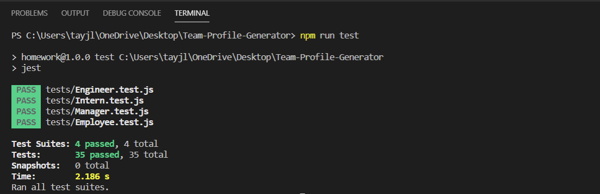

# Table of Contents:
* [Title](#Title)
* [Description](#Description)
* [Usage](#Usage)
* [Installation](#Installation)
* [Contribution](#Contribution)
* [Tests](#Tests)
* [License](#License)
* [Github](#Github)
* [Email](#Email)

# Title: Team-Profile-Generator

# Description 
This project generates an html file that displays all of your team members and their roles through Node.js and the terminal. The application will prompt the user several parameters for each of your team members in order to create an HTML page that is styled with Bootstrap. The information displayed will involve a team member's name,role, and contact information which changes depending on the role assigned to that team member. Managers will be prompted for their office phone number. Interns will be prompted for the school they are currently learning from. Engineers will be prompted for their github profile name. 

# Usage 
It is necessary to install all of the dependencies and after ensuring the package.json is in the root directory. Do this by:
```
npm i 
```
Then to begin the process of calling the application, open the integrated terminal on the root directory. Type in the terminal:
``` 
node index.js 
```


# Installation 
Clone the repository from Github. Open the integrated terminal. Make sure the package.json is present. Install the necessary dependencies through npm i . 

# Contribution
Clone or fork the repo. Make a branch to make your edits or changes. Submit a pull request for review. 

# Tests
If you would like to ensure that the application will work, check that the tests will pass. 
```
npm install jest
```
Then
```
npm run test
```


# License
This project is under the MIT License
MIT License
Copyright (c) 2021 Taylor Leong
Permission is hereby granted, free of charge, to any person obtaining a copy
of this software and associated documentation files (the "Software"), to deal
in the Software without restriction, including without limitation the rights
to use, copy, modify, merge, publish, distribute, sublicense, and/or sell
copies of the Software, and to permit persons to whom the Software is
furnished to do so, subject to the following conditions:

The above copyright notice and this permission notice shall be included in all
copies or substantial portions of the Software.

THE SOFTWARE IS PROVIDED "AS IS", WITHOUT WARRANTY OF ANY KIND, EXPRESS OR
IMPLIED, INCLUDING BUT NOT LIMITED TO THE WARRANTIES OF MERCHANTABILITY,
FITNESS FOR A PARTICULAR PURPOSE AND NONINFRINGEMENT. IN NO EVENT SHALL THE
AUTHORS OR COPYRIGHT HOLDERS BE LIABLE FOR ANY CLAIM, DAMAGES OR OTHER
LIABILITY, WHETHER IN AN ACTION OF CONTRACT, TORT OR OTHERWISE, ARISING FROM,
OUT OF OR IN CONNECTION WITH THE SOFTWARE OR THE USE OR OTHER DEALINGS IN THE
SOFTWARE.

# Github
Link to github repository: 
https://github.com/tjl2125/Team-Profile-Generator

# Email
tjl2125@alum.barnard.edu
Feel free to contact me for more information. 